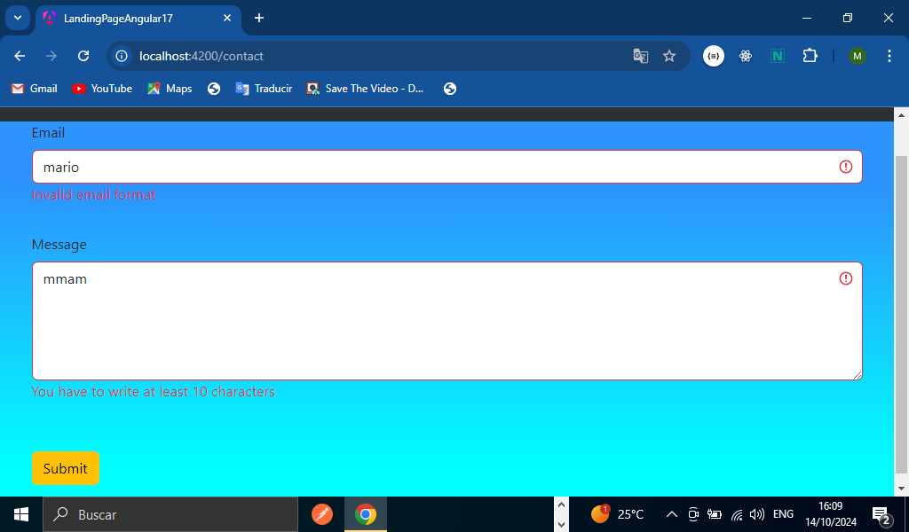

# TITULO DEL PROYECTO    

**Aplicación Web Landing Page En Angular17**

# DESCRIPCIÓN DEL PROYECTO (Pagina web de venta de productos en Angular)
**Desarrollamos una página web, se trata de una landing Page donde el usuario puede navegar a través de una barra de navegación a diferentes apartados de la aplicación los cuales son los siguientes 4: Home, Products,ProductsDetail y Contact. El usuario podrá consultar productos ver a detalle cada producto podrá también contactar a través de un formulario y hacer sus comentarios. A continuación Vamos a explicar a detalle cada sección y con todas las herramientas que nos proporcionó Angular 17 para su elaboración además explicación en código y más:**

## SECCION NAVBAR PARA NAVEGAR EN NUESTRA APLICAION
**Para generar nuestra aplicación creamos una carpeta Pages donde van a ir todos nuestros componentes en este caso creamos el de Home,Product,product-detail y contact(ng g c pages/home y así con los demás componentes).También a su vez creamos un servicio que se encargara de hacer las peticiones a una API de los Productos(ng g s services/api). Además vamos a construir un barra de navegación con sus diferentes rutas cada ,puedes consultar nuestro archivo app.component.html de nuestro repositorio donde se encuentra el navbar en código**

## RUTAS DE NUESTRA APLICACION DE ANGULAR(Enrutamiento)
**Para generar nuestras en Angular haremos uso de la propiedad Routes de Angular , generamos cada ruta de cada componentes como se puede observar en a continuación:(Archivo app.routes.ts)**
```TypeScript
    import { Routes } from '@angular/router';
    import { HomeComponent } from './pages/home/home.component';
    import { ProductsComponent } from './pages/products/products.component';
    import { ProductDetailComponent } from './pages/product-detail/product-detail.component';
    import { ContactComponent } from './pages/contact/contact.component';

    export const routes: Routes = [
        {path: '', component: HomeComponent},
        {path: 'products', component: ProductsComponent},
        {path: 'products/:id', component: ProductDetailComponent},
        {path: 'contact', component: ContactComponent},
        {path: '**', redirectTo:'', pathMatch: 'full'}
    ];
```
## VINCULACION DEL NAVBAR CON LAS RUTAS DE LA APLICAION(routerLink)
**Aquí en esta parte hicimos uso de la propiedad de Angular routerLink para poder enlazar la barra de navegación con cada ruta de nuestra aplicación, además de la propiedad ngClass para poder cambiar la clase active y mostrarle al usuario en donde está colocado, A continuación mostramos el código de cómo se vinculó el componente Home con el NavBar y así fue con todos los componentes el código completo en el archivo app.component.hmtl de nuestro repositorio**
```TypeScript
    <li class="nav-item">
        <a class="nav-link fs-5 fw-bold" routerLink="" 
            [ngClass]="{active:  menuOption == 'home'}" 
            (click)="onOption('home')">Home
        </a>
    </li>
```
## Funcionalidad de la clase Active(ngClass)
**Para que esto funcione nos falta crear el método menuOption en nuestro archivo app.component.ts para darle la funcionalidad a nuestro ngClass de la propiedad Active(código completo en nuestro archivo app.component.ts):**
```TypeScript
    import { RouterLink, RouterOutlet } from '@angular/router';
    standalone: true,
    imports: [CommonModule,RouterOutlet, RouterLink],
    export class AppComponent {
        menuOption: string = ''
        onOption(menuOption: string){
            this.menuOption = menuOption
        }
    }
```

# VISTA PREVIA DE COMO SE VE NUESTRO HOME DE NUESTRA APLICACION YA FUNCIONANDO


## Llamado a la API en Angular17(HttpClient)
**Para realizar las peticiones http a nuestra API usamos la propiedad de Angular HttpClient que nos va permitir hacer llamados a la API en este proyecto creamos un servicio llamado api(ng g services/api).Mostrando en código como programamos el servicio cabe mencionar que solo hicimos el método jet y el método get por id:**

```TypeScript
    import { Injectable, inject } from '@angular/core';
    import { HttpClient } from '@angular/common/http'
    import { Observable } from 'rxjs';
    import { IProduct } from '../models/product.model';

    export class ApiService {

        private _http = inject(HttpClient);
        private urlBase: string = 'https://fakestoreapi.com/products';

        getProducts() : Observable<IProduct[]>{
            return this._http.get<IProduct[]>(this.urlBase)
        }

        getProduct(id: number):Observable<IProduct>{
            return this._http.get<IProduct>(`${this.urlBase}/${id}`);
        }
    }
```

## Implementación del provider HttpClient
**Para que el httpClient funcione correctamente en nuestra aplicación hay que hacer uso de un provider esto lo clocamos en nuestro archivo app.config.ts que dando de la siguiente manera:**
```TypeScript
    import { provideHttpClient } from '@angular/common/http';

    export const appConfig: ApplicationConfig = {
        providers: [
        provideRouter(routes), 
        provideClientHydration(),
        provideHttpClient()
        ]
    };
```
## Manejo de la pantalla productos(Modelo de productos TypeScript)
**Para esta sección de los productos creamos una tabla donde nos mostrara los productos traídos del BackEnd para esto realizamos un modelo de productos es decir una interface a la que llamamos IProduct como se muestra a continuación:**
```TypeScript
        export interface IProduct {
        id:          number;
        title:       string;
        price:       number;
        description: string;
        category:    Category;
        image:       string;
        rating:      Rating;
    }

    export enum Category {
        Electronics = "electronics",
        Jewelery = "jewelery",
        MenSClothing = "men's clothing",
        WomenSClothing = "women's clothing",
    }

    export interface Rating {
        rate:  number;
        count: number;
    }
```
## Inyección del Servicio en el componente(archivo product.component.ts)
**En esta parte hacemos la inyección del servicio en el componente de los productos para poderlos mostrar y manejar el HTML la tabla a través de un ciclo for como se muestra a continuación(código completo en nuestros archivos del repositorio)**
```TypeScript
    export class ProductsComponent implements OnInit {
    productList: IProduct[] = []
    private _apiService = inject(ApiService);
    private _route = inject(Router)

    ngOnInit(): void {
        this._apiService.getProducts().subscribe((data: IProduct[]) => {
        console.log(data)
        this.productList = data
        }
        );
    }
```

```HTML
    @for (product of productList; track $index){
        <tr>
            <th scope="row">{{product.id}}</th>
            <td>{{product.title}}</td>
            <td>{{product.price | currency}}</td>
            <td>{{product.description}}</td>
            <td><button type="button" class="btn btn-outline-success" (click)="navegate(product.id)">Details</button></td>
        </tr>
    }
```
# VISTA PREVIA DE COMO SE VE NUESTRO PRODUCTS-DETAIL DE NUESTRA APLICACION YA FUNCIONANDO


## Manejo de pantalla detalle del producto(Navigate)
**En esta parte del proyecto vamos a mostrar en otra pantalla y en otra ruta el detalle del producto que el usuario seleccione a través del botón detail, para poder realizar esta parte hicimos uso de la propiedad Route y navigate de Angular para que podamos navegar como se muestra a continuación:**
```TypeScript
    import { Router } from '@angular/router';
    private _route = inject(Router)
    navegate(id: number): void {
        //console.log(id)
        this._route.navigate(['/products',id]);
    }
```
## Inyección del servicio en el componente product-detail(ActivateRoute,params y subscribe)
**Para poder mostrar el detalle del producto el cual lo vamos hacer a través de una card en HTML tenemos que hacer uso de las subscripciones en Angular el inject para inyectar el servicio hacer el método get recibiendo como parámetro el id. A continuación mostramos el código para hacer la petición a través del id(código completo en el archivo de nuestro repositorio)**
```TypeScript
    import { ActivatedRoute } from '@angular/router';
    import { ApiService } from '../../services/api.service';
    import { IProduct } from '../../models/product.model';

    export class ProductDetailComponent implements OnInit {
        loading:boolean = true;
        public product?: IProduct

        private _route = inject(ActivatedRoute);
        private _apiService = inject(ApiService)

        ngOnInit(): void {
            this._route.params.subscribe(params =>{
            this._apiService.getProduct(params['id']).subscribe((data: IProduct) => {
                this.product = data
                this.loading = false
            });
            })
        }
    }
```
```HTML
    @if (loading){
            <h5>Loading...</h5>
    }
        
    @if (!loading){
        <div class="card" style="width: 20rem;">
            
            <div class="card-body">
                <h4>{{product?.price | currency }}</h4>
                <h5 class="card-title">{{product?.title}}</h5>
                <p class="card-text">{{product?.description}}</p>
            </div>
        </div>
    }
```
# VISTA DE NUESTRA PANTALLA DETALLE DE PRODUCTO YA FUNCIONANDO


## Pantalla de contacto de nuestra aplicacion(Formulario)
**En esta última sección es la sección de contacto esto lo hicimos a través de un formulario y le aplicamos algunas validaciones con algunas propiedades que Angular posee como el Validators, ReactiveFormModule entre otras cosas. ya que en la vista HTML lo hicimos a través de un if para ir validando los campos a continuación parte del código del formulario(código completo en nuestro archivo de nuestro repositorio)**
```TypeScript
    import { ReactiveFormsModule, FormGroup, FormBuilder, Validators } from '@angular/forms';

    export class ContactComponent implements OnInit {

        contactForm!: FormGroup;

        constructor(private FormBuilder: FormBuilder){

            this.contactForm = this.FormBuilder.group({
            email: ['', [Validators.required, Validators.email]],
            message: ['',[Validators.required, Validators.minLength(10)]]
        })
    }
```
```HTML
    <div class="mb-3">
        <label for="exampleFormControlInput1" class="form-label">Email</label>
        <input type="email" 
                class="form-control" 
                id="exampleFormControlInput1"
                placeholder="name@example.com" 
                formControlName="email"
                [ngClass]="{'is-invalid' : hasErrors('email', 'required') || hasErrors('email', 'email')}"
        >
        @if(hasErrors('email', 'required')){
            <span class="text-danger">You have to complete this field</span>
        }
        @if(hasErrors('email','email')){
            <span class="text-danger">Invalid email format</span>
        }
            
    </div>
```
# VISTA DE NUESTRO FORMULARIO DE CONTACTO CON SU MANEJO DE ERRORES Y VALIDACIONES:


### Lista De Tecnologías, Propiedades De Angular Y Herramientas Usadas En Nuestro Proyecto(Lista De Tareas)  

1. HTML
2. CSS 
3. TypeScript
4. Uso De @For(Angular17)
5. Uso De @if(Angular17)
6. Uso HttpClient(Peticiones http a la API)
7. Uso De ReactiveFormsModule(Angular) 
8. Validators(Angular) 
9. Uso De inject(Angular) 
10. Routes, ActivateRoute, Navigate(Enrutamiento)
11. Bootstrap 
12. Manejo de Modelos(Interfaces TypeScript)
13. Observables y Subscribes(Rxjs)
14. GitHub

*Elaborado Por: Mario Martínez Aguilar*
